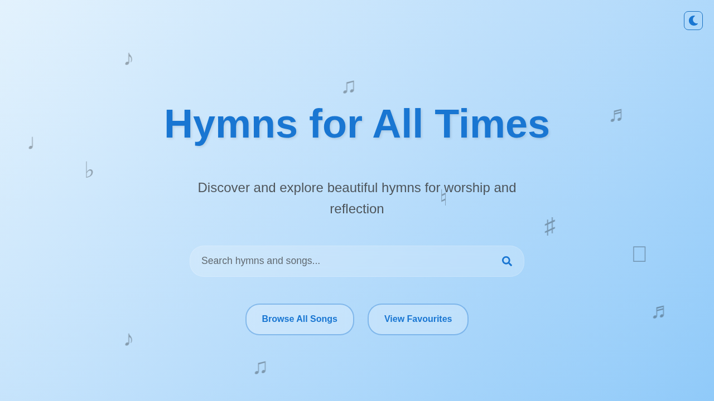
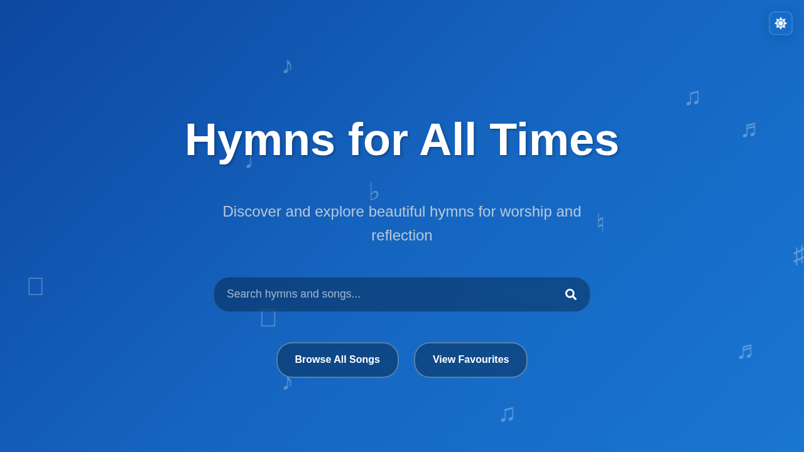
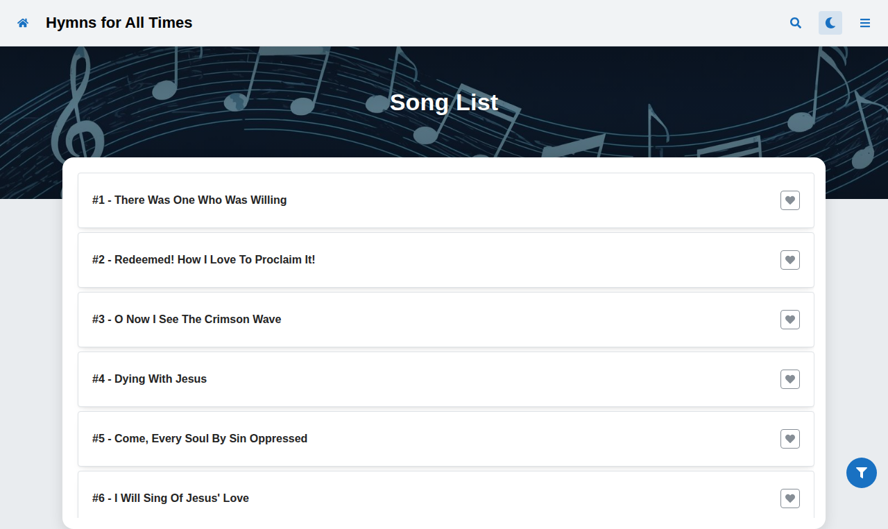
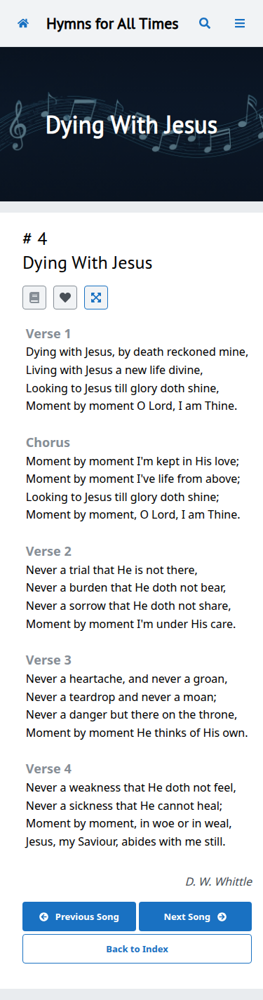

# Hymns for all Times

A modern, React-powered single page application, allowing users to ditch their paper hymnals in favor of something portable. Built with TypeScript, this project uses several awesome libraries including Mantine UI, Fuse.js, and localforage.

### Desktop Experience

### Mobile Experience

### Song List & Display

While this particular version is built with a specific object structure in mind (Songs), it is absolutely flexible enough to work with other setups, provided you update the types.

This application supports dark mode and will adapt to your device preferences.

## Copyright

I claim no ownership to any of the included song lyrics. If you are the copyright holder to any of these songs, and you'd like them to be removed, please open an issue or send me an email at keno@claytoninnovations.com.

This project will in no way seek any form of monetization and is just a fun side project.

## Contributing

If you have any suggestions feel free to open an issue!

## Development

Get started by ensuring you have an up-to-date version of `node` (LTS is recommended) with `npm` or `yarn` installed.

- `npm install` or `yarn install` - Install the latest dependencies locally
- `npm run dev` or `yarn dev` - Launches the development server
- `npm run test` or `yarn test` - Runs typecheck, prettier, lint, vitest, and build
- `npm run build` or `yarn build` - Compiles the production version of the website
- `npm run analyze` or `yarn analyze` - Analyzes a compiled build folder and provides insight into bundle sizes
